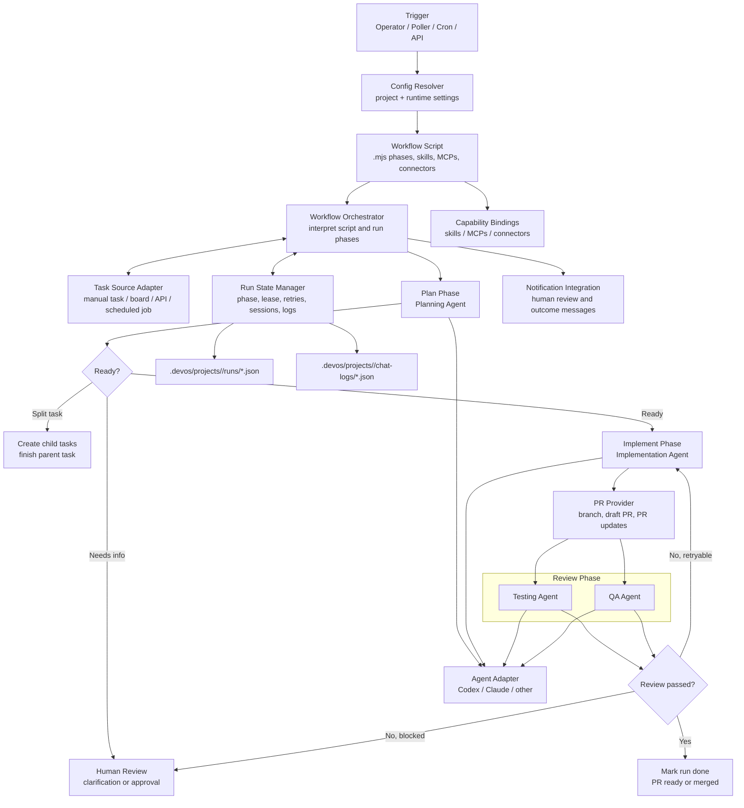

# Architecture

## System Purpose

devos.ing is a multi-project orchestration hub that turns eligible tasks into a copyable PIV workflow: plan, implement, and review.

## Ownership Boundaries

1. `packages/cli/src/features/config/` owns runtime config resolution from env vars, home-scoped onboarding state, and server-owned project metadata.
2. `packages/cli/src/features/workflow/` owns the Workflow Orchestrator role: loading workflow scripts, selecting tasks, running phases, updating run state, handling retries, and pausing for human review.
3. Integration modules stay isolated under `packages/cli/src/integrations/`, while agent runtime adapters live in `packages/agent-adapters/`:
   - `packages/cli/src/integrations/linear/linear.ts`
   - `packages/cli/src/integrations/github/github.ts`
   - `packages/agent-adapters/src/codex/index.ts`
   - `packages/agent-adapters/src/claude/index.ts`
   - `packages/cli/src/integrations/notifications/notifications.ts`
4. Server-owned cron runtime and scheduling live under `packages/server/src/cron/` (entrypoint: `packages/server/src/cron/run-cron.ts`).
5. `packages/cli/src/features/workflow/state.ts` owns run-state paths and legacy fallback behavior.
6. `packages/cli/src/args.ts` and `packages/cli/src/index.ts` own CLI parsing and command dispatch with command handlers in `packages/cli/src/commands/`.

## PIV Phase Model

The default workflow has three phases:

1. `plan`: one planning agent turns task context into an implementation goal.
2. `implement`: one implementation agent applies the plan and prepares PR context.
3. `review`: two review agents validate the result:
   - `testing` checks commands, test output, and executable evidence.
   - `qa` checks product fit, acceptance criteria, regressions, and handoff quality.

The Workflow Orchestrator owns phase order and retries; task source adapters, PR providers, agent adapters, MCP tools, connector integrations, state storage, and notifications own their respective side effects. Review output must preserve the parsing contract:

- `RESULT: PASS|FAIL`
- `SUMMARY: ...`
- `BUGS_JSON: [...]`

## System Diagram



## Workflow Script Model

Workflow definitions should be copyable `.mjs` modules. The orchestrator reads the script to learn the phases, which agents run in each phase, and which skills, MCP tools, and connectors are available.

```javascript
export default {
  id: "piv-default",
  phases: [
    {
      id: "plan",
      agents: [{ id: "planner", skill: "skills/plan.md" }],
      connectors: ["task-source"],
    },
    {
      id: "implement",
      agents: [{ id: "implementer", skill: "skills/implement.md" }],
      mcps: ["github", "filesystem"],
      connectors: ["pr-provider"],
    },
    {
      id: "review",
      agents: [
        { id: "testing", skill: "skills/testing.md" },
        { id: "qa", skill: "skills/qa.md" },
      ],
      mcps: ["github", "filesystem"],
      gates: ["RESULT: PASS|FAIL", "SUMMARY", "BUGS_JSON"],
    },
  ],
};
```

## Multi-Project Runtime Rules

1. Every run resolves to one or more `project.id` values.
2. Run state is persisted under `.devos/projects/<project-id>/runs`.
3. Status reads require an explicit project id.
4. Default invocation without project flags targets the first configured project.
5. `--all-projects --issue <KEY>` must resolve to one unique project mapping.

## Integration Flow

1. Task source adapters provide eligible tasks and route them by project config.
2. The Workflow Orchestrator loads the `.mjs` workflow script and resolves phase capabilities.
3. The plan phase builds the task goal from task context, skills, and optional connector data.
4. The implement phase applies code changes and creates or updates PR context.
5. The review phase runs testing and QA agents, then emits structured pass/fail output and bug payload.
6. Failed verification feeds back into implementation until pass or blocked.
